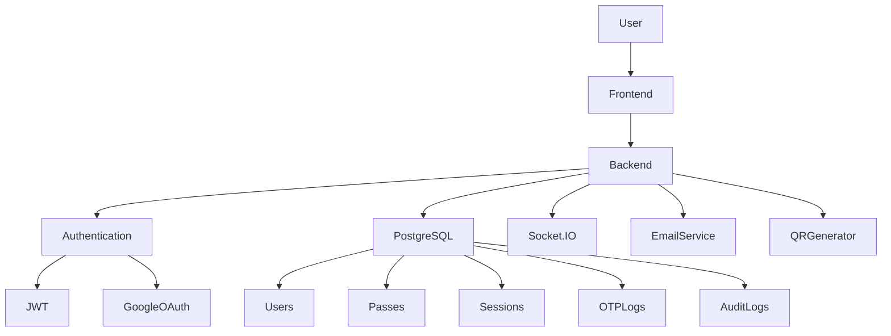

# SmartPass Pro

## 1. Project Introduction

SmartPass Pro is a modern, enterprise-grade digital gate pass management platform designed to replace traditional paper-based visitor and student movement systems used in educational institutions. The platform provides a centralized, secure, and real-time environment where students, teachers, principals, administrators, and security personnel can collaboratively manage gate pass requests through dedicated role-based portals. By digitizing the complete gate pass lifecycle—from request creation to approval, verification, and auditing—SmartPass Pro significantly improves operational efficiency, institutional security, accountability, and user experience.

Many schools, colleges, universities, and training institutions continue to rely on handwritten gate passes and manual approval workflows. Although simple, these methods often introduce delays, human errors, misplaced records, unauthorized alterations, forged signatures, poor visibility into student movement, and limited accountability. Manual processes also make it difficult for administrators to generate reports, investigate incidents, or monitor real-time campus activity. During emergencies or audits, retrieving historical records becomes time-consuming and unreliable.

SmartPass Pro was developed to address these operational and security challenges by introducing a fully digital, cloud-ready gate pass ecosystem. The platform streamlines communication between students, teachers, administrators, and campus security while maintaining complete transparency throughout every stage of the approval process. Every request, approval, rejection, verification, and status update is recorded automatically, creating a comprehensive audit trail that enhances institutional governance and compliance.

The platform follows a role-based architecture where each stakeholder receives only the permissions necessary for their responsibilities. Students can submit and monitor pass requests, teachers can initiate or review requests according to institutional policies, principals and administrators oversee approvals and operational management, while security personnel verify authorized exits using dynamically generated QR codes. This separation of responsibilities reduces administrative overhead while strengthening access control and minimizing the risk of unauthorized actions.

A major objective of SmartPass Pro is to provide real-time visibility into campus movement. Traditional paper systems often leave administrators unaware of current student status until physical records are manually reviewed. SmartPass Pro eliminates this limitation through Socket.IO-powered real-time synchronization, ensuring that all connected portals receive instant updates whenever a request is submitted, approved, rejected, verified, or modified. This enables faster decision-making and provides a consistent operational view across the institution.

Security has been incorporated as a foundational design principle rather than an afterthought. Authentication mechanisms combine secure password-based login, JWT access tokens, refresh token management, and Google OAuth authentication to provide flexible yet protected user access. Sensitive operations are protected through role-based authorization, input validation, secure HTTP headers, rate limiting, session management, OTP verification, and comprehensive audit logging. These layered security controls help protect the application against common web vulnerabilities while ensuring that every privileged operation remains traceable.

Replacing paper-based gate passes with a digital workflow also delivers measurable operational benefits. Administrative staff spend less time processing manual paperwork, approval times are significantly reduced, security personnel can verify passes within seconds, and institutional records become searchable and permanently stored within a centralized database. Digital records simplify reporting, compliance audits, and historical analysis while reducing paper consumption and operational costs.

The platform has been designed with scalability and maintainability in mind. A modular Node.js and Express.js backend separates authentication, authorization, business logic, database operations, communication services, and real-time messaging into independent components. PostgreSQL running on Neon provides a reliable cloud-native relational database capable of supporting increasing numbers of users, requests, and historical records. This architecture enables institutions to expand deployments without requiring major changes to the underlying application.

Production readiness is another core objective of SmartPass Pro. The system incorporates standardized security middleware, structured validation, centralized error handling, secure authentication flows, persistent database storage, real-time synchronization, scalable API architecture, and cloud database integration. These components collectively provide a stable foundation suitable for deployment in real educational environments where reliability, security, and availability are essential.

The vision of SmartPass Pro is to modernize campus access management by creating a secure, intelligent, and paperless ecosystem that promotes accountability, operational efficiency, and digital transformation across educational institutions. Rather than serving only as a gate pass application, the platform aims to become an integrated campus movement management solution capable of supporting future enhancements such as analytics dashboards, attendance integration, visitor management, notification systems, mobile applications, and AI-powered administrative insights.

The mission of the project is to provide educational institutions with an affordable, secure, scalable, and user-friendly platform that simplifies gate pass management while maintaining high standards of security, transparency, and operational excellence. By leveraging modern web technologies, real-time communication, cloud infrastructure, and enterprise security practices, SmartPass Pro empowers institutions to replace outdated manual workflows with a dependable digital solution.

The primary objectives of SmartPass Pro include digitizing gate pass management, strengthening institutional security, reducing administrative workload, enabling real-time communication, improving user accountability, maintaining comprehensive audit records, supporting multiple user roles, simplifying verification through QR technology, ensuring secure authentication, and providing a scalable architecture capable of adapting to future organizational growth. These objectives collectively position SmartPass Pro as a reliable, enterprise-ready platform suitable for modern educational institutions seeking secure digital transformation.

---

# 2. System Architecture

SmartPass Pro follows a layered, modular architecture that separates presentation, business logic, authentication, security, communication, and data persistence into independent components. This design improves maintainability, scalability, performance, and long-term extensibility while enabling secure interaction between multiple user roles.

## Architecture Overview

| Layer          | Technologies                                            | Responsibilities                                            |
| -------------- | ------------------------------------------------------- | ----------------------------------------------------------- |
| Frontend       | HTML5, CSS3, JavaScript, Socket.IO Client               | User Interface, Dashboard, Real-Time Updates                |
| Backend        | Node.js, Express.js, Socket.IO                          | REST APIs, Business Logic, Authentication, Real-Time Events |
| Database       | PostgreSQL (Neon)                                       | Persistent Storage for Users, Passes, Sessions, Logs        |
| Authentication | JWT, Refresh Tokens, Google OAuth                       | Secure Login, Session Management, Token Validation          |
| Security       | Helmet, Rate Limiting, Joi Validation, RBAC, Audit Logs | Application Protection and Authorization                    |
| Communication  | Socket.IO                                               | Instant Synchronization Across Portals                      |
| Email Service  | Resend                                                  | OTP Delivery, Notifications, Verification Emails            |
| QR Module      | QR Code Generator                                       | Secure Pass Generation and Gate Verification                |

## Frontend Architecture

The frontend provides responsive role-based dashboards for Students, Teachers, Principals, Guards, and Administrators. Built using HTML, CSS, and JavaScript, it communicates with the backend through secure REST APIs while maintaining persistent Socket.IO connections for live updates. The interface dynamically renders data based on authenticated user roles and ensures seamless navigation across different workflows.

## Backend Architecture

The backend is powered by Node.js and Express.js using a modular architecture. Dedicated modules handle authentication, authorization, pass management, QR generation, email services, database operations, and audit logging. Socket.IO runs alongside the HTTP server to provide event-driven communication between connected clients.

## Database Layer

PostgreSQL hosted on Neon acts as the centralized data repository. The relational database stores user accounts, authentication sessions, gate pass requests, OTP records, audit logs, and system metadata. ACID compliance ensures transactional consistency while Neon enables cloud-native scalability and reliability.

Core database entities include:

* Users
* Roles
* Gate Passes
* Sessions
* Refresh Tokens
* OTP Logs
* Audit Logs
* Notifications

## Authentication Layer

Authentication supports both traditional email/password login and Google OAuth. Upon successful authentication, the server issues a short-lived JWT access token together with a secure refresh token. Refresh tokens enable seamless session renewal without requiring frequent user logins while maintaining strong security controls.

## Security Layer

SmartPass Pro adopts a defense-in-depth strategy by combining multiple security mechanisms.

| Security Component      | Purpose                          |
| ----------------------- | -------------------------------- |
| Helmet                  | Secure HTTP headers              |
| Rate Limiting           | Prevent brute-force attacks      |
| Joi Validation          | Validate incoming requests       |
| JWT Authentication      | Secure API access                |
| Refresh Tokens          | Secure session renewal           |
| RBAC                    | Restrict features based on roles |
| Audit Logs              | Complete activity tracking       |
| Secure Password Hashing | Protect user credentials         |
| Environment Variables   | Secure configuration management  |

## Email & OTP Service

The Resend email service delivers verification emails, OTPs, password reset links, approval notifications, and security alerts. OTP verification adds another layer of protection for sensitive operations and gate validation.

## QR Code Generation & Verification

Each approved gate pass receives a unique QR code that securely represents the pass identity. At the campus gate, authorized guards scan the QR code, allowing the backend to validate authenticity, verify pass status, prevent duplicate usage, and update the pass lifecycle accordingly.

## Real-Time Communication

Socket.IO enables bi-directional communication between the server and all connected clients. Whenever a pass is created, approved, rejected, verified, or updated, the backend immediately broadcasts the change to relevant dashboards, eliminating the need for manual page refreshes and ensuring all stakeholders view synchronized information.

## Architecture Diagram



---

# 3. Working Pipeline

SmartPass Pro follows a secure, role-driven workflow that ensures every gate pass request is authenticated, authorized, verified, and permanently recorded.

| Step   | Process                                                                                                                                                                                                                                               |
| ------ | ----------------------------------------------------------------------------------------------------------------------------------------------------------------------------------------------------------------------------------------------------- |
| **1**  | User opens the SmartPass Pro application and accesses the login portal.                                                                                                                                                                               |
| **2**  | The user authenticates using Email/Password or Google OAuth.                                                                                                                                                                                          |
| **3**  | The backend validates credentials and generates a JWT Access Token together with a Refresh Token.                                                                                                                                                     |
| **4**  | Based on the authenticated role (Student, Teacher, Principal, Guard, or Administrator), the user is redirected to the appropriate dashboard.                                                                                                          |
| **5**  | A Student or Teacher submits a new gate pass request with the required details and supporting information.                                                                                                                                            |
| **6**  | The request is routed to the appropriate Principal or Administrator for review, where it is approved or rejected according to institutional policy.                                                                                                   |
| **7**  | Upon approval, the system generates a One-Time Password (OTP) and a unique QR Code linked to the approved pass. Notifications are delivered through the email service.                                                                                |
| **8**  | At the campus exit or entry point, the Guard scans the QR Code. The backend validates the QR code, verifies pass authenticity, checks OTP or pass status where applicable, and authorizes the movement.                                               |
| **9**  | Socket.IO instantly broadcasts status changes to every connected dashboard, ensuring Students, Teachers, Principals, Guards, and Administrators receive real-time updates without refreshing the page.                                                |
| **10** | Every operation—including login, pass creation, approval, rejection, QR verification, OTP validation, and administrative actions—is recorded within immutable Audit Logs for accountability and compliance.                                           |
| **11** | Throughout the entire workflow, session management, JWT validation, refresh token rotation, role-based authorization, request validation, rate limiting, and other security controls continuously protect the application and maintain secure access. |

### End-to-End Workflow Summary

```text
User Access
      │
      ▼
Authentication
(Email/Password or Google OAuth)
      │
      ▼
JWT + Refresh Token Issued
      │
      ▼
Role-Based Dashboard
      │
      ▼
Gate Pass Request
      │
      ▼
Principal/Admin Approval
      │
      ▼
OTP + QR Code Generation
      │
      ▼
Guard Verification
      │
      ▼
Real-Time Status Update (Socket.IO)
      │
      ▼
Audit Logging & Secure Session Management
```

SmartPass Pro's workflow combines secure authentication, role-based authorization, cloud-backed persistence, QR-enabled verification, real-time communication, and comprehensive audit logging into a unified digital ecosystem. The result is a production-ready platform that replaces manual gate pass processes with a secure, scalable, transparent, and efficient solution for modern educational institutions.
| Module           | Features                                                                       |
| ---------------- | ------------------------------------------------------------------------------ |
| Authentication   | Email Login, Google OAuth, JWT Authentication, Refresh Tokens, Secure Sessions |
| Student Portal   | Create Requests, Track Status, View History, Profile Management                |
| Teacher Portal   | Create Student Passes, Review Requests, Real-Time Updates                      |
| Principal Portal | Approve/Reject Requests, Monitor Activity, Dashboard Analytics                 |
| Guard Portal     | QR Scanner, OTP Verification, Entry/Exit Validation                            |
| Admin Portal     | User Management, Role Management, Audit Monitoring, System Configuration       |
| Security         | RBAC, Helmet, Rate Limiting, Password Hashing, Input Validation                |
| Communication    | Socket.IO Real-Time Synchronization                                            |
| Notification     | Email Notifications, OTP Verification                                          |
| Reports          | Pass History, Audit Logs, User Activity                                        |
=====================================================================================================
| Technology        | Purpose                 |
| ----------------- | ----------------------- |
| HTML5             | Structure               |
| CSS3              | Responsive UI           |
| JavaScript (ES6+) | Client Logic            |
| Socket.IO Client  | Real-Time Communication |
==============================================
| Technology   | Purpose             |
| ------------ | ------------------- |
| Node.js      | Runtime Environment |
| Express.js   | REST API Framework  |
| Socket.IO    | Real-Time Events    |
| JWT          | Authentication      |
| Google OAuth | Social Login        |
| Technology | Purpose                  |
| ---------- | ------------------------ |
| PostgreSQL | Relational Database      |
| Neon       | Managed Cloud PostgreSQL |
| Technology         | Purpose                |
| ------------------ | ---------------------- |
| Helmet             | HTTP Security Headers  |
| express-rate-limit | Brute Force Protection |
| Joi                | Request Validation     |
| bcrypt             | Password Hashing       |
| JWT                | Secure Authentication  |
| Table          | Description             |
| -------------- | ----------------------- |
| users          | User Accounts           |
| roles          | System Roles            |
| gate_passes    | Pass Information        |
| refresh_tokens | Authentication Sessions |
| otp_logs       | OTP Records             |
| audit_logs     | Security Events         |
| notifications  | Email Notifications     |
=============================================================
| Security Control     | Description                        |
| -------------------- | ---------------------------------- |
| JWT Authentication   | Secure access tokens               |
| Refresh Tokens       | Long-lived session management      |
| Google OAuth         | Trusted third-party authentication |
| bcrypt               | Password hashing                   |
| Helmet               | Secure HTTP headers                |
| Rate Limiting        | Prevent brute-force attacks        |
| RBAC                 | Role-based permissions             |
| Joi Validation       | Request validation                 |
| SQL Parameterization | Prevent SQL Injection              |
| CORS Protection      | Cross-origin access control        |
| Secure Cookies       | Token protection                   |
| Audit Logs           | Complete activity tracking         |
| OTP Verification     | Additional verification layer      |
| QR Validation        | Prevent duplicate pass usage       |
=============================================================
